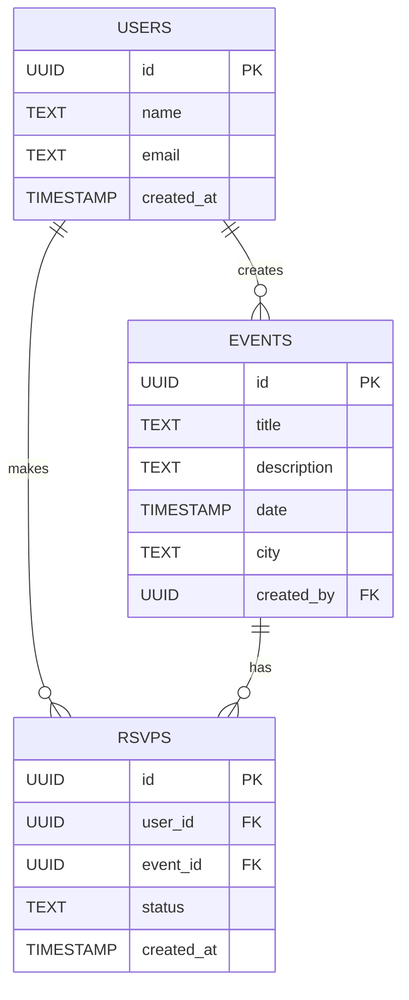
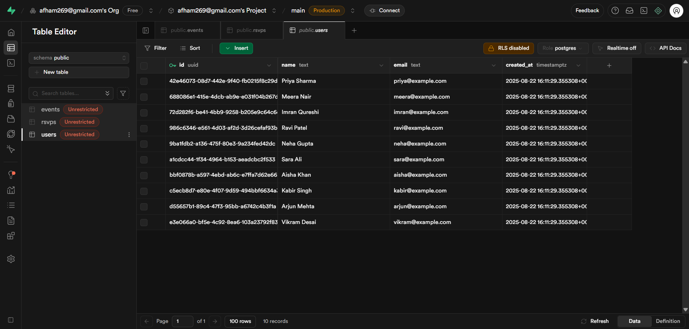
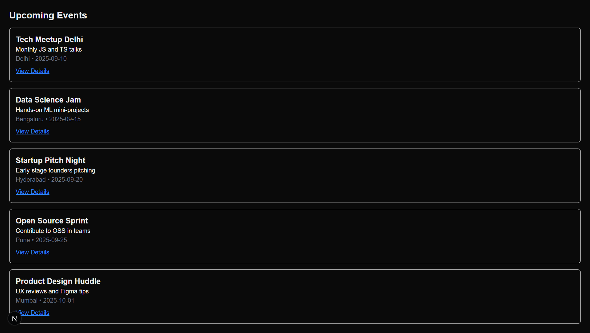
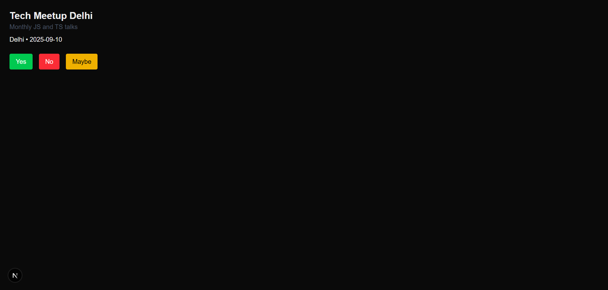
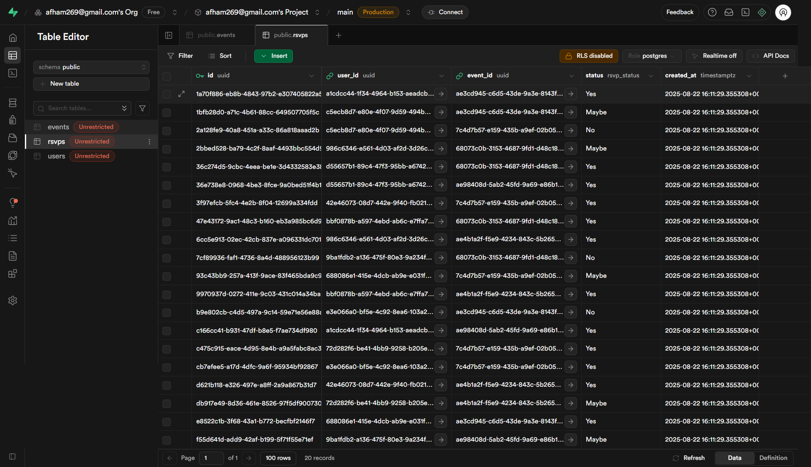
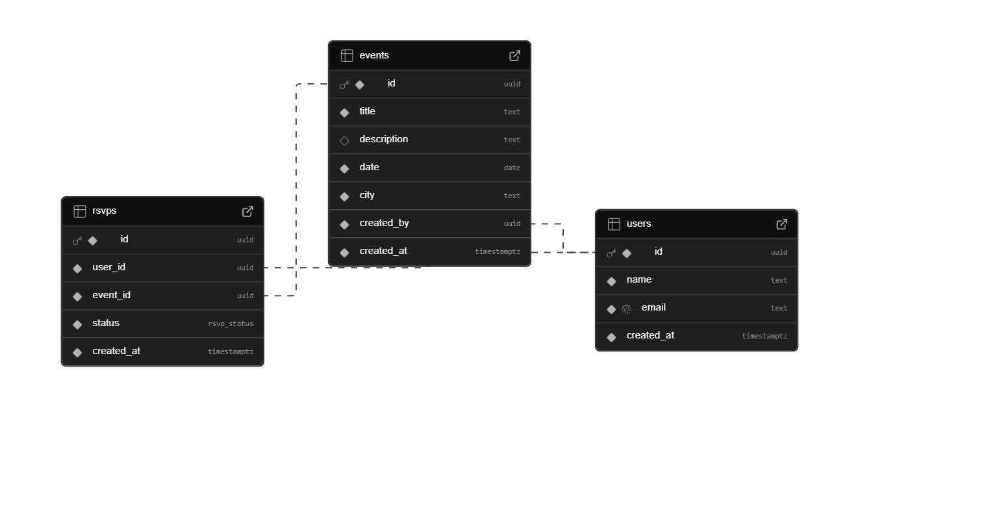
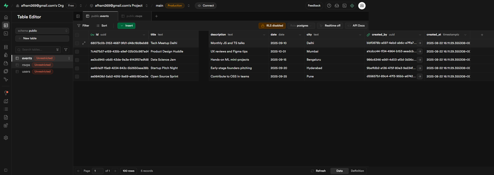

# Events RSVP Platform

## Project Overview

This project is a simple platform where users can register, create events, and RSVP to those events. It consists of a **Supabase backend** (PostgreSQL) and a **Next.js frontend**.

* Users can view a list of upcoming events.
* Users can see event details and RSVP as **Yes / No / Maybe**.
* RSVP data is stored in Supabase.

This project was created as part of a database and web application assessment.

---

## Database Design (Supabase)


### Database ER Diagram


### Tables

1. **Users**

   * `id` (UUID, PK)
   * `name` (Text)
   * `email` (Text, Unique)
   * `created_at` (Timestamp, default now)

2. **Events**

   * `id` (UUID, PK)
   * `title` (Text)
   * `description` (Text)
   * `date` (DateTime)
   * `city` (Text)
   * `created_by` (FK → Users.id)

3. **RSVPs**

   * `id` (UUID, PK)
   * `user_id` (FK → Users.id)
   * `event_id` (FK → Events.id)
   * `status` (Enum: Yes / No / Maybe)
   * `created_at` (Timestamp, default now)

### Sample Data & ER Diagram

* **Users Table:** 
* **Events Table:** 
* **Event Details Table:** 
* **RSVPs Table:** 
* **ER Diagram:** 
* **Upcoming Events Page:** 

### Design Choices

* **Referential Integrity:** Deleting a user cascades to their RSVPs.
* **RSVP Tracking:** Each RSVP links a user to a specific event with a status.
* **Timestamps:** `created_at` fields to track record creation.

---

## Next.js Frontend

The frontend uses **Next.js 15+ (App Router)** and **Supabase JS client**.

### Pages

1. **Upcoming Events**

   * `/events`
   * Fetches all events from Supabase and lists them with links to details.

2. **Event Details & RSVP**

   * `/events/[id]`
   * Shows event details and a form to RSVP (**Yes / No / Maybe**).
   * Submits RSVPs to the `rsvps` table.

---

### Running Locally

1. Clone the repository:

```bash
git clone https://github.com/Afham2263/events-rsvp.git
cd events-rsvp
```

2. Install dependencies:

```bash
npm install
```

3. Create `.env.local` in the root with your Supabase credentials:

```env
NEXT_PUBLIC_SUPABASE_URL=https://<your-project-ref>.supabase.co
NEXT_PUBLIC_SUPABASE_ANON_KEY=<your-anon-key>
```

4. Run the development server:

```bash
npm run dev
```

* Visit `http://localhost:3000/events` to see the app in action.

---

### Project Structure

```
events-rsvp/
├─ app/
│  ├─ events/
│  │  ├─ page.tsx        # Upcoming events list
│  │  ├─ [id]/
│  │  │  ├─ page.tsx     # Event details
│  │  │  ├─ rsvp/route.ts # RSVP POST handler
├─ lib/
│  ├─ supabase.ts        # Supabase client
├─ screenshots/          # All DB and page screenshots
├─ schema.sql            # SQL dump
├─ package.json
├─ tsconfig.json
└─ README.md
```
